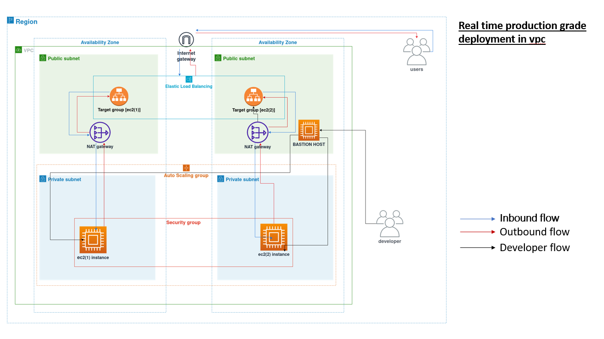
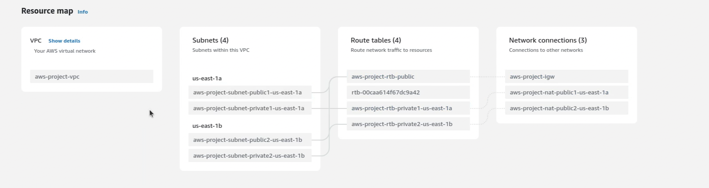
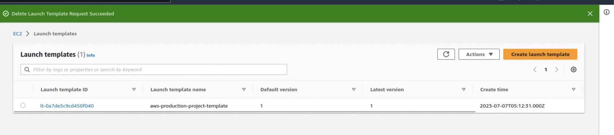
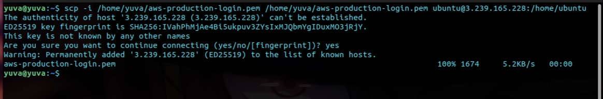

# Real-time Production Grade Deployment in VPC with Auto Scaling Group, Target Group, and Load Balancer

This guide will walk you through the steps to deploy a real-time production-grade application in a Virtual Private Cloud (VPC) using Amazon Web Services (AWS) resources, including an Auto Scaling Group, Target Group, and Load Balancer. This setup ensures high availability, scalability, and fault tolerance for your application.

## Prerequisites
- Basic knowledge of AWS services, specifically VPC, Auto Scaling Group, Target Group, Load Balancer and SCP protocol.
## YouTube video link :
    https://youtu.be/XnQLcjPPNuQ

## Demo

https://github.com/yuva19102003/real-time-production-grade-deployment/assets/116803074/f5fc81c6-013a-41d8-86f4-47f6e5592a15

## Flowchart
    
   
# Steps

### Step 1: Set Up a VPC

1. Open the AWS Management Console.
2. Navigate to the VPC service.
3. Create a new VPC or use an existing one. Make sure to configure appropriate subnets, route tables, and security groups to suit your application's requirements.

### Step 2: Create an Auto Scaling Group

1. In the AWS Management Console, navigate to the Auto Scaling service.
2. Create a new Auto Scaling Group using the templates. 
3. .
4. Configure the desired instance type, launch configuration, and other settings as per your application requirements.
5. Specify the minimum and maximum number of instances to scale.

6. Set up scaling policies based on metrics like CPU utilization, network traffic, or application-specific metrics.
   
### step 3: create a bastion host and transfer the key pair

- create a bastion host in public subnet of the vpc

-transfering the key pairs from local machine to bastion host

 ### step 4: connect and run the application in EC2
 
- Now connect to the bastion host from local machine using SSH.

- Then connect that two private subnet ec2 instance from the bastion host using SSH
- Then import and run the application in that two private subnet ec2 instance.

### Step 5: Configure a Target Group

1. In the AWS Management Console, navigate to the EC2 service.
2. Create a new Target Group.
3. Configure the target group with appropriate target type (e.g., instance or IP), protocol, and port.

4. Define health checks to monitor the health of instances in the target group.

### Step 6: Set Up a Load Balancer

1. In the AWS Management Console, navigate to the EC2 service.
2. Create a new Load Balancer.
3. Choose the appropriate load balancer type (e.g., Application Load Balancer or Network Load Balancer) based on your application requirements.
4. Configure listeners to handle incoming traffic and route it to the target group.
5. Specify the subnets and security groups for the load balancer.
6. Configure health checks and other advanced settings as needed.

### Step 6: Test and Validate

1. Deploy your application to the instances launched by the Auto Scaling Group.
2. Access the Load Balancer's DNS or IP address to access your application.
3. Test your application's functionality and monitor the scaling behavior.

## Conclusion

By following these steps, you have successfully deployed a real-time production-grade application in a VPC using AWS resources like Auto Scaling Group, Target Group, and Load Balancer. This setup ensures high availability, scalability, and fault tolerance for your application, allowing it to handle increased traffic and scale as needed. Feel free to customize and optimize this setup further based on your specific requirements.

